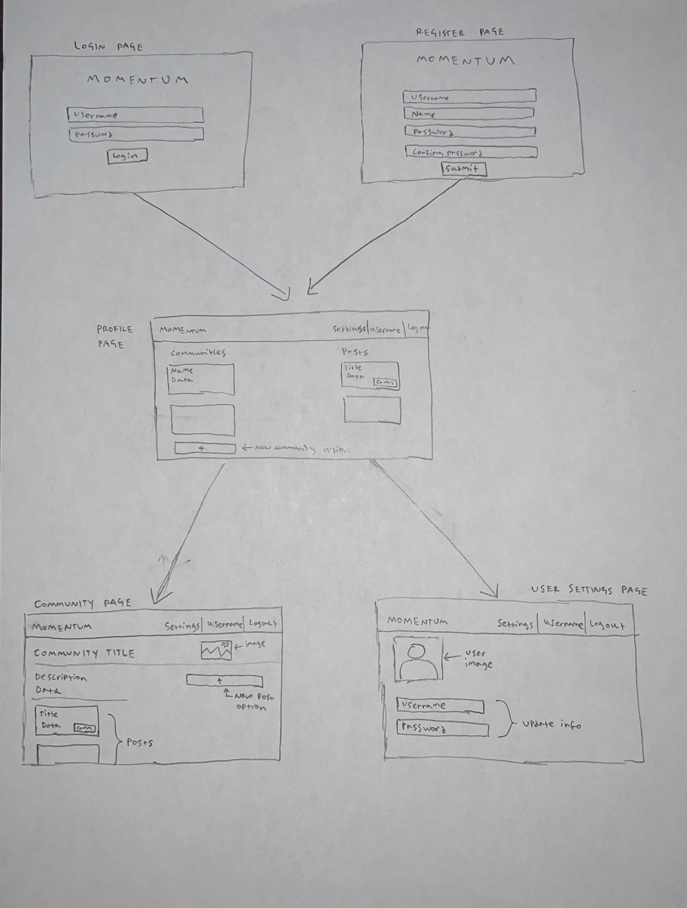
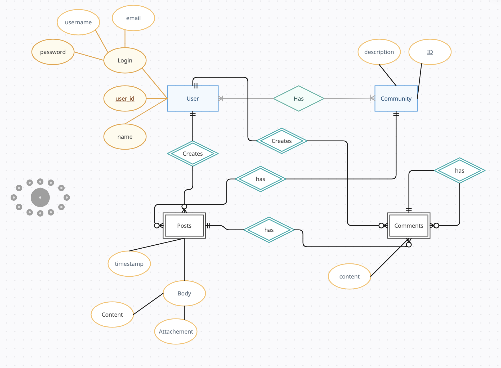

# Momentum Prototype

## Description with UI sketch of main use cases

### Description

**Overview of functionality**
We intend to create a Reddit-Twitter-like social media app. The application will support the creation of user accounts with customizable usernames and profile images. The main content of the app will be centered around community-generated posts. Users will be able to link/join their accounts to communities they are interested in. Community posts will be visible to all community members and may contain text as well as image content. Community members will also be able to leave comments on posts. Communities are identified by a title/name and will have a description and optional community image.
**Application Flow**

* The landing page of the app will allow users to either create an account or log into an existing account.
* Once signed in, users will be directed to a profile page where they can view all of the communities they are in, as well as options to join new communities or create a community. The profile page will also contain data on recent posts that the user has made.
* Each community will have page that will have general community info at the top (name, description, image, member count, number of posts), followed by the community posts. There will be an option on the right margin of the page for users to create a new post in the community.
* Each individual post will have a main container to display contents of the post (author, author profile image, title, body contents), as well as a hidden dropdown container that will display comments associated with that post. Each comment will be a line that contains the username of the commenter and the comment body (text only). Nested comments will not be supported.
* There will be a common navbar at the top for all pages except for the landing page, which will allow users to logout of their account, go back to the profile page, or go to a separate settings page.
* The settings page will allow users to modify their username and profile image.

**Current Status**
The prototype is currently connected with the GraphQL/MariaDB backend and allows for creation of new accounts as well as logging in/logging out of existing accounts. The general layout of the profile page as well as the community page has been established. No other features/pages are fully functional as of yet.

### UI Sketch



## Database design

### Description of data entities and relationships

Data Entities: Comments, Communities, Posts, and Users.

At a high level, the relationships are as follows:

A user has:

1. rid: A record ID
2. name: the user's name
3. username
4. password
5. email
6. communities: The communities a user subscribes to
7. posts: The posts a user has made
8. comments: The comments a user has made.

A post has:

1. rid: A record id
2. user: The user who created the post
3. content: the text of the post
4. timestamp
5. community: the community a post is in
6. comments: any comments on the post
7. file: any attachments

A comment has:

1. rid: A record id
2. user: The user who created the pose
3. content: the text of the post
4. timestamp
5. parent: If this exists, the comment this comment replied to.
6. post: If this exists, the post the comment was made on.
7. comments: Any replies to this comment.

A community has:

1. rid: A unique identifier
2. description: Description of the community
3. users: the users in this community
4. posts: the posts made in this community.

However, as this is a graphql interface, some of these relationships can be done via graphql resolvers.
As a result, although at a high level a user has posts, the user table does not contain information about posts.
Rather, the GQL interface searches the posts table for all posts by a specific user when the front end wants the
posts by a user.  Additionally, although the posts and comments have unique keys, this is for database safety reasons -
they cannot exist without a user per the schema.

Note that there is a many to many relationship between users and communities.  To provide this, we have a user_community table, which allows for a record
of which users belong to a community and vice versa.

This is shown in more detail in the ERD.  Specifics of the tables are shown in the CREATE statements in the database design sql file,
rather than repeated here.

### Entity-relationship diagram file



### SQL code to design database and sample data file

database_design.sql

```sql
-- Create Statements
CREATE TABLE IF NOT EXISTS `momentum`.`comments` (
    `id` int(10) unsigned NOT NULL AUTO_INCREMENT,
    `user` varchar(255) NOT NULL,
    `content` TEXT NOT NULL,
    `parent` int(10),
    `timestamp` DATETIME NOT NULL,
    `post` int(10),
    PRIMARY KEY (`id`)
);
CREATE TABLE IF NOT EXISTS `momentum`.`communities` (
    `id` int(10) unsigned NOT NULL AUTO_INCREMENT,
    `description` text,
    `users` varchar(255) NOT NULL,
    PRIMARY KEY (`id`)
);
CREATE TABLE IF NOT EXISTS `momentum`.`posts` (
    `id` int(10) unsigned NOT NULL AUTO_INCREMENT,
    `user` varchar(255) NOT NULL,
    `content` text NOT NULL,
    `community` int(10) NOT NULL,
    `timestamp` DATETIME NOT NULL,
    `file` MEDIUMBLOB,
    PRIMARY KEY (`id`)
);
CREATE TABLE IF NOT EXISTS `momentum`.`users` (
    `id` int(10) unsigned NOT NULL AUTO_INCREMENT,
    `communities` text,
    `password` varchar(255) NOT NULL,
    `username` varchar(255) NOT NULL,
    `name` varchar(255) NOT NULL,
    `email` varchar(255) NOT NULL,
    PRIMARY KEY (`id`)
);
CREATE TABLE IF NOT EXISTS `momentum`.`user_community` (
    `id` int(10) unsigned NOT NULL AUTO_INCREMENT,
    `user_id` int(10),
    `community_id`int(10),
    PRIMARY KEY (`id`)
);
-- Sample Data
INSERT INTO `users` (
        `id`,
        `communities`,
        `password`,
        `username`,
        `name`,
        `email`
    )
VALUES (
        17,
        '17',
        'password',
        'nmcclaran',
        'Nathan McClaran',
        'nmcclaran@tamu.edu'
    );
INSERT INTO `posts` (
        `id`,
        `user`,
        `content`,
        `community`,
        `timestamp`,
        `file`
    )
VALUES (
        1,
        '17',
        'nmcclaran_3',
        17,
        '2023-09-29 22:41:58',
        NULL
    );
INSERT INTO `communities` (`id`, `description`, `users`)
VALUES (17, 'nmcclaran_2', '17');
INSERT INTO `comments` (
        `id`,
        `user`,
        `content`,
        `parent`,
        `timestamp`,
        `post`
    )
VALUES (
        1,
        '17',
        'nmcclaran_2',
        NULL,
        '2023-09-29 22:41:58',
        1
    ),
    (
        2,
        '17',
        'nmcclaran_2',
        NULL,
        '2023-09-29 22:41:58',
        1
    ),
    (
        3,
        '17',
        'nmcclaran_2',
        NULL,
        '2023-09-29 22:41:58',
        1
    );
INSERT INTO `user_community` (`id`, `user_id`, `community_id`)
VALUES
 (1, 3, 2),
 (2, 3, 1),
 (3, 2, 2),
 (4, 2, 5);

```

## Architectural design

The Momentum project is designed as a three tier archetecture.  The client contains a plain HTML/JS GUI for user interactions. We utilize ES6 JavaScript to allow us to separate our business logic (such as GraphQL interface code) in distinct modules.

The server itself is a graphql server, which manages interactions with the database and performs some of the relationship logic through resolvers.
This allows for a simpler table, as relationships don't need to be managed directly in the database.

The database is the third part of the architecture, and is a basic single schema four table MySQL database, running in a MariaDB Docker container.
As is common with industry databases, the database itself is not accessed outside of its specific API, in this case the gql server.

## Prototype

### Running the Momentum application

Instructions for running the databse is in the README file in `momentum_gql`. The frontend may be launched simply by opening `momentum_frontend/landing.html`

GQL server: `momentum_gql`
GUI application: `momentum_frontend`

Database is run via docker-compose in momentup_gql.  Data and tables are not persistent, and will need to be added via the sql commands.

### Video recordings of user acceptance tests

[YouTube Link](https://www.youtube.com/watch?v=3KVG15_2eeI)
