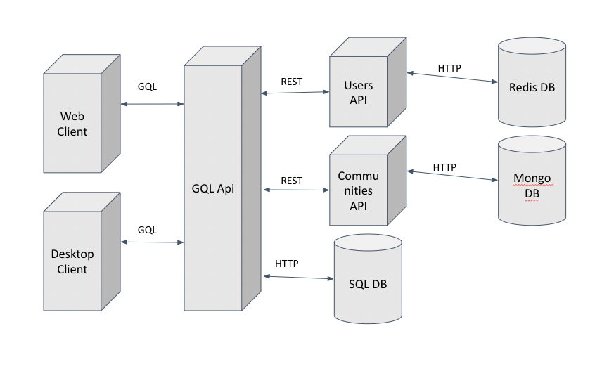

# Momentum Prototype

TODO: Add Mongodb sample data
TODO: Add Redis Sample Data
TODO: Check previous submissions and fix issues

## Description of all use cases with UI sketch

### Description

**Overview of functionality**
We intend to create a Reddit-Twitter-like social media app. The application will support the creation of user accounts with customizable usernames and profile images. The main content of the app will be centered around community-generated posts. Users will be able to link/join their accounts to communities they are interested in. Community posts will be visible to all community members and may contain text as well as image content. Community members will also be able to leave comments on posts. Communities are identified by a title/name and will have a description and optional community image.
**Use Cases**
**1: Login**

* Actors: All users must login to their accounts to use the application
* Goals: The actors login in order to identify and authenticate themselves in the system
* Preconditions: The login is performed from the landing page
* Summary: The user enters their email and password on the landing page and submits it to the system
* Related use cases: See Registration
* Steps: 1. Enter username 2. Enter password 3. Submit form data
* Postconditions: If successful, the actor will be redirected to their profile page. Otherwise, the page will alert them that the login failed

**2: Reigstration**

* Actors: All users must register accounts to use the application
* Goals: The actors register in order to create identities for them to use on the application
* Preconditions: The registration is performed from the registration page
* Summary: The user enters their email, name, desired username, and password on the registration page and submits it to the system
* Related use cases: See Login
* Steps: 1. From landing page, go to registration page 2. Enter required data 3. Submit form data
* Postconditions: If successful, the actor will be redirected to their profile page. Otherwise, the page will alert them that the registration failed

**3: Logout**

* Actors: All users will logout in order to close their session on the client
* Goals: The actors logout in order to close their session and prevent misuse of their accounts
* Preconditions: The client maintains the actor's login information. The logout may be performed from any authenticated page (excludes landing and registration pages)
* Summary: The actor presses the logout button in the toolbar
* Related use cases: See Login, Registration
* Steps: 1. On any authenticated page, press logout button in the toolbar
* Postconditions: The client-side tokens will be cleared from the user's system and the actor is redirected to the landing page

**4: Create Community**

* Actors: Users who wish to create a community that does not currently exist
* Goals: To create a community for posts/discussion surrounding the topic of the community
* Preconditions: Communities are created from the actor's profile page
* Summary: The actor enters the name and description of the new community on the profile page
* Related use cases: See Join Community
* Steps: 1. On the profile page, enter the community name 2. Enter the community description 3. Create the community
* Postconditions: The new community will be displayed on the actor's list of communities on the profile page

**5: Join Community**

* Actors: Users who wish to join a community that interests them
* Goals: To join a community for posts/discussion surrounding the topic of the community
* Preconditions: Communities are joined from the actor's profile page
* Summary: The actor enters the community code of the community they wish to join on their profile page
* Related use cases: See Create Community
* Steps: 1. On the profile page, enter the community code 2. Submit and join the community
* Postconditions: If successful, the new community will be displayed on the actor's list of communities on the profile page. Otherwise, the page will alert them that the community joining failed

**6: Create Post**

* Actors: Users who wish to contribute to a community with a post
* Goals: To post about something relevant to the topic of the community
* Preconditions: Posts may be submitted from the page of a specific community
* Summary: The actor enters the content of their post on the respective community page and submits it
* Related use cases: See Comment on Post
* Steps: 1. On the profile page, go to the desired community 2. In the community page, enter the post data 3. Submit post data
* Postconditions: The new post will be displayed in the list of posts of the community. Other actors may leave comments on the post.

**7: Comment on Post**

* Actors: Users who wish to comment on an existing post
* Goals: To post about something relevant to the topic of the community
* Preconditions: Comments are made from the community page of a specific community
* Summary: The actor types their comment in a field adjacent to the post they wish to comment on
* Related use cases: See Create Post
* Steps: 1. On the profile page, go to the desired community 2. In the community page, find the desired post and write the comment 3. Submit the comment
* Postconditions: The new comment will be displayed underneath the post for which the comment was made

**8: Go to Settings**

* Actors: Users who wish to change some characteristics of their profile
* Goals: To change some aspects of the actor's profile (profile image, username, password)
* Preconditions: The settings page can be entered from any authenticated page
* Summary: The actor presses the settings button in the toolbar
* Related use cases: See Update User Image, Update Username, Update Password
* Steps: 1. On any authenticated page, press settings button in the toolbar
* Postconditions: The actor is redirected to the settings page for their account

**9: Update User Image**

* Actors: Users who wish to change their profile image, which is displayed on posts and comments
* Goals: To change the appearance of the actor to other users
* Preconditions: Any update of user profile data must be done from the settings page
* Summary: The actor selects the option to upload a new profile image and selects a file from their device
* Related use cases: See Update Username, Update Password, Go to Settings
* Steps: 1. On any authenticated page, go to settings (in the toolbar) 2. In the settings page, select the option for a new profile image 3. Find a new image on the actor's filesystem 4. Upload the desired image
* Postconditions: The image will now be applied on all posts and comments the actor makes

**10: Update Username**

* Actors: Users who wish to change their username, which is displayed on posts and comments
* Goals: To change the username of the actor
* Preconditions: Any update of user profile data must be done from the settings page
* Summary: The actor types their new username and confirms it
* Related use cases: See Update User Image, Update Password, Go to Settings
* Steps: 1. On any authenticated page, go to settings (in the toolbar) 2. In the settings page, type a new username 3. Submit the username
* Postconditions: The username will now be applied on all posts and comments the actor makes. In addition, it will be seen on the actor's toolbar.

**11: Update Password**

* Actors: Users who wish to change their password
* Goals: To change the password to be easier to remember, for example.
* Preconditions: Any update of user profile data must be done from the settings page
* Summary: The actor types their new password and confirms it
* Related use cases: See Update User Image, Update Password, Go to Settings
* Steps: 1. On any authenticated page, go to settings (in the toolbar) 2. In the settings page, type a new password 3. Submit the password
* Postconditions: The new password will now be required for the user to login.

**Current Status**
The current iteration is currently connected with the GraphQL/MariaDB backend and allows for creation of new accounts, logging in/logging out of existing accounts, the creation of new communities, and posting in communities. The general layout of the profile page as well as the community page has been established. No other features/pages are fully functional as of yet.

### UI Sketch

The respective use case numbers are labelled on the transition arrows between pages


## Database design

### Description of data entities and relationships

Data Entities: Comments, Communities, Posts, and Users.

At a high level, the relationships are as follows:

A user has:

1. rid: A record ID
2. name: the user's name
3. username
4. password
5. email
6. communities: The communities a user subscribes to
7. posts: The posts a user has made
8. comments: The comments a user has made.

A post has:

1. rid: A record id
2. user: The user who created the post
3. content: the text of the post
4. timestamp
5. community: the community a post is in
6. comments: any comments on the post
7. file: any attachments

A comment has:

1. rid: A record id
2. user: The user who created the pose
3. content: the text of the post
4. timestamp
5. parent: If this exists, the comment this comment replied to.
6. post: If this exists, the post the comment was made on.
7. comments: Any replies to this comment.

A community has:

1. rid: A unique identifier
2. description: Description of the community
3. users: the users in this community
4. posts: the posts made in this community.

However, as this is a graphql interface, some of these relationships can be done via graphql resolvers.
As a result, although at a high level a user has posts, the user table does not contain information about posts.
Rather, the GQL interface searches the posts table for all posts by a specific user when the front end wants the
posts by a user.  Additionally, although the posts and comments have unique keys, this is for database safety reasons -
they cannot exist without a user per the schema.

The community table is unique, in that it is stored as a MongoDB document rather than a sql table. This allows us to keep a list of users in each community, and search that list to get all communities that a user belongs to.

This is shown in more detail in the ERD.  Specifics of the tables are shown in the CREATE statements in the database design sql file,
rather than repeated here.

### Entity-relationship diagram file


### SQL code to design database and sample data file

database_design.sql

```sql
-- Create Statements
CREATE TABLE IF NOT EXISTS `momentum`.`comments` (
    `id` int(10) unsigned NOT NULL AUTO_INCREMENT,
    `user` varchar(255) NOT NULL,
    `content` TEXT NOT NULL,
    `parent` int(10),
    `timestamp` DATETIME NOT NULL,
    `post` int(10),
    PRIMARY KEY (`id`)
);

CREATE TABLE IF NOT EXISTS `momentum`.`posts` (
    `id` int(10) unsigned NOT NULL AUTO_INCREMENT,
    `user` varchar(255) NOT NULL,
    `content` text NOT NULL,
    `community` VARCHAR(255) NOT NULL,
    `timestamp` DATETIME NOT NULL,
    `file` MEDIUMBLOB,
    PRIMARY KEY (`id`)
);

-- Sample Data
INSERT INTO `posts` (
        `id`,
        `user`,
        `content`,
        `community`,
        `timestamp`,
        `file`
    )
VALUES (
        1,
        '17',
        'nmcclaran_3',
        "mongodb_id",
        '2023-09-29 22:41:58',
        NULL
    );
INSERT INTO `comments` (
        `id`,
        `user`,
        `content`,
        `parent`,
        `timestamp`,
        `post`
    )
VALUES (
        1,
        '17',
        'nmcclaran_2',
        NULL,
        '2023-09-29 22:41:58',
        1
    ),
    (
        2,
        '17',
        'nmcclaran_2',
        NULL,
        '2023-09-29 22:41:58',
        1
    ),
    (
        3,
        '17',
        'nmcclaran_2',
        NULL,
        '2023-09-29 22:41:58',
        1
    );

```

### Mongodb code to design database and sample data file

```txt
use("Momentum");

db.customers.insertOne(
   {
    _id: ObjectId('656d175c0f313512c360703d'),
    description: 'nmcclaran',
    users: [
        12,
        1
    ]
}
);

```

## Architectural design

The Momentum project is designed as a three tier archetecture (Although we note that the non-sql microservices have a fourth tier).  The client contains a plain HTML/JS GUI for user interactions. We utilize ES6 JavaScript to allow us to separate our business logic (such as GraphQL interface code) in distinct modules.

The server itself is a graphql server, which manages interactions with the database and performs some of the relationship logic through resolvers.
This allows for a simpler table, as relationships don't need to be managed directly in the database.  This communicates over http with the GQL protocol.  The GQL server serves as the posts/community microservice, and allows us to maintain the benefits of GQL (reduced load on uncessesary microservices) without major rewrites to the established frontend.

The user microservice uses a restful API written in Go. It communicates with a redis labs redis database for user information.  The community microservice uses a resful Python API communicating with a container based mongodb server.  We use three different databases - a redis database for users, a mongodb database for communities, and a sql database for posts and comments.  The user and community databases have restful microservices which translate from the GQL interface to the dbs.  The sql database is hooked directly into the DB.  We chose this design to preserve the GQL functionality and backwards compatibility.  Each of these communicates with http protocol.  The microservice apis communitcate with RESTFUL api protocols.

The database is the third part of the architecture, and has a basic single schema two table MySQL database, running in a MariaDB Docker container.
As is common with industry databases, the database itself is not accessed outside of its specific API, in this case the gql server.  We also have a MongoDB database and a Redis database.

The communication between the client and server is done using JSON payloads over HTTP

### Architectural diagram file



### Division of Labor

#### Nathan

* GQL middleware/service registry
* posts/comments api (Part of the GQL middleware)
* Communities Microservice

## Prototype

### Running the Momentum application

#### Necessary Libraries

For the backend, all you need is Docker.

#### How to start

To start the microservices, simply run docker compose up in the microservices folder.  The frontend may be launched simply by opening `momentum_frontend/landing.html`.

GQL server: `microservices/momentum_gql`
MongoDB interface: `microservices/mdb_interface`
User interface: `microservices/users`

GUI application: `momentum_frontend`

#### Guidelines

Database is run via docker-compose in momentup_gql.  Data and tables are not persistent, and can be added via the sql commands.  However, the system is designed to start empty, so creating data through the GUI is preferred.  Note that you must create a certain item before adding that item to another entity (IE user 1 must be created before adding to community 1, and vice versa.)

**IMPORTANT NOTE**: You might encounter some adverse database behavior. Some of our database properties have changed since the last iteration. Please delete your existing mariadb/sql Docker container if any issues occur.

### Video recordings of user acceptance tests

[YouTube Link](https://youtu.be/WZka9VaFppI)
